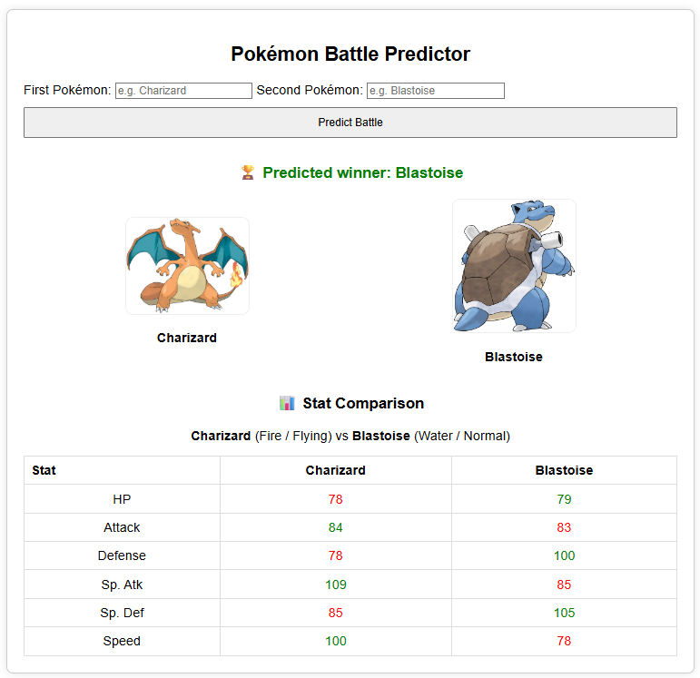

# Pokémon Battle Predictor

A machine learning-powered web app that predicts the outcome of Pokémon battles based on stats and type effectiveness.

---

## 📋 Table of Contents
- [About](#about)
- [Features](#features)
- [Tech Stack](#tech-stack)
- [Getting Started](#getting-started)
- [Usage](#usage)
- [Model Details](#model-details)
- [Screenshots](#screenshots)
- [License](#license)

---

## 📖 About

This project is a full-stack data science application that predicts which Pokémon would win in a one-on-one battle. 
It combines data preprocessing, simulation-based model training, and a Flask-based web frontend.

---

## 🚀 Features

- Predicts battle outcomes using Pokémon stats and type matchups
- Clean and responsive web interface
- Autocomplete for Pokémon names
- Visual stat comparison and artwork display

---

## 🧰 Tech Stack

- **Python** – Data manipulation and model training
- **Flask** – Web framework for API and frontend
- **scikit-learn** – Model training (DecisionTreeClassifier)
- **HTML/CSS** – Web UI
- **Render** – Hosting platform

---

## 🛠️ Getting Started

1. Clone the repository:
   ```bash
   git clone https://github.com/yourusername/pokemon-battle-predictor.git
   cd pokemon-battle-predictor
   ```

2. Install dependencies:
   ```bash
   pip install -r requirements.txt
   ```

3. Run the app:
   ```bash
   python app.py
   ```

The app will be live at `http://localhost:5001`.

---

## 🎮 Usage

- Enter two Pokémon names into the form (e.g., Charizard vs Blastoise).
- The app will predict the winner and show their stats and artwork.

---

## 🧠 Model Details

The prediction model was trained on a dataset of 50,000 simulated battles based on:

- Total base stats for each Pokémon
- Type effectiveness (double-type logic)
- Outcomes calculated using a scoring formula

**Model Used**: DecisionTreeClassifier from scikit-learn  
**Features**:
- `stat_sum_1`, `stat_sum_2`
- `type_eff_1_to_2`, `type_eff_2_to_1`

---

## 🖼️ Screenshots



---

## 📄 License

This project is licensed under the MIT License.
